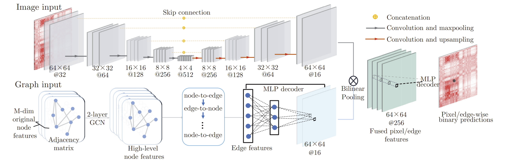

# GILoop
GILoop is a deep learning model for detecting CTCF-mediated loops on Hi-C contact maps. 




#### Installation:

```
conda create -n GIL python=3.8
conda activate GIL
pip install -r requirements.txt
```

After running the code segment above, please download `models` and `data` from [GILoop_assets](https://portland-my.sharepoint.com/:f:/g/personal/fuzhowang2-c_my_cityu_edu_hk/EpsC_y58ARNInLGjwy4yc44BNs2fKzCXNFVLUxrsrtHO2A?e=83KzE4) and **replace the ones in the local directory**. 

#### Usage:

```
python demo.py
```

Full API usage is documented in [demo.py](./demo.py).